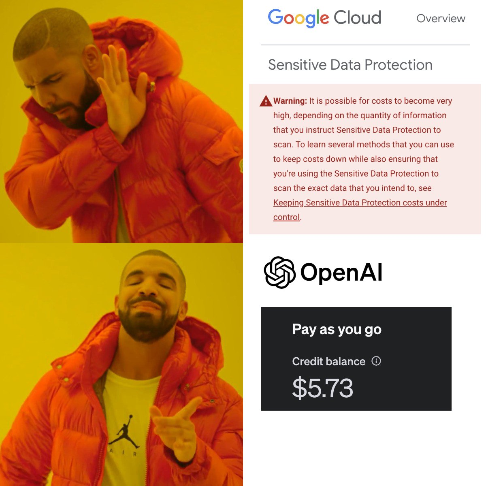
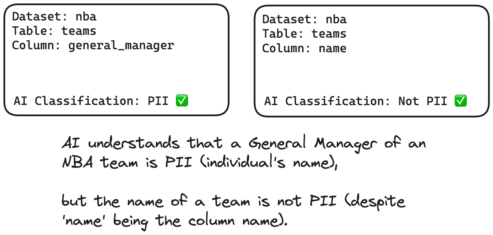

# PII Detective 🕵️

## Overview
PII Detective is a web application designed to identify, classify, and protect Personally Identifiable Information (PII) in data platforms such as BigQuery and Snowflake. It leverages LLMs to identify PII column names, and with human-in-the-loop validation, uses Dynamic Data Masking Policies to easily enforce Access Control Limits (ACLs) while minimizing user friction.  

## Why?
Dynamic Data Masking is an extremely powerful and user-friendly way to protect sensitive data such as PII. SHA256 encryption lets data scientists interact with PII data (filtering, aggregations, relational JOINs, etc.) without having to view the raw PII data. Data platforms such as BigQuery and Snowflake have very easy way to set up data masking, however, knowing _where_ PII columns are can be a massive challenge, especially if the platform is used heavily across multiple functions in your organization. 

For example, GCP has a Sensitive Data Protection service which promises similar functionality, but it [can become extremely costly](https://cloud.google.com/sensitive-data-protection/pricing#risk_analysis) since it runs hundreds of regex queries on the entire contents of the table. For comparison, PII Detective only uses table metadata such as table and columns names, so you can detect PII in thousands of tables for less than $5 of OpenAI credits!

Despite its relatively simple approach, PII Detective performs exceptionally well. LLMs are able to make human-level assumptions and context reasoning that were previously impossible to automate. 

## Demo
https://github.com/kpolley/PIIDetective/assets/13952270/c41d4b8b-c66a-42e1-a89f-f96db4c87b72

## Setting Up
### BigQuery

[Follow these steps](https://cloud.google.com/bigquery/docs/column-data-masking) to create a BigQuery Data Catalog Taxonomy and Policy Tag. While policy tags can get rather granular and detailed, I'd suggest starting off with a single tag `PII` which masks data with SHA256 encryption

The application will also need access to the following roles:
* `BigQuery Admin`
* `BigQuery Metadata Viewer`
* `BigQuery Masked Data Viewer`

### Snowflake
[Follow these steps](https://docs.snowflake.com/en/user-guide/security-column-ddm-use) to create a Dynamic Data Masking Policy and role. 

### Postgres DB
This application uses Postgres to keep track of detected columns and other various functions. To run a postgres instance locally with Docker, run `npm run db` and `npm run prisma migrate dev` to initialize the DB. 

### Set env variables
Check out `.env.example` to see the sample config. If running locally, these can be stored in `.env.local`

## Run!
run `npm run dev` to start the application and visit `http://localhost:3000` to view the UI. 
